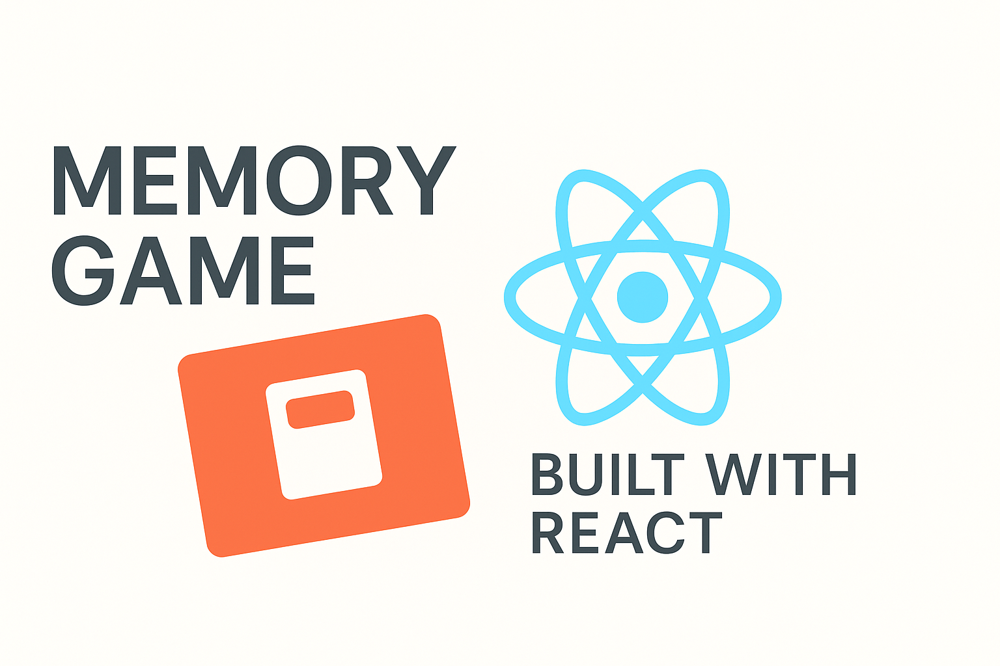
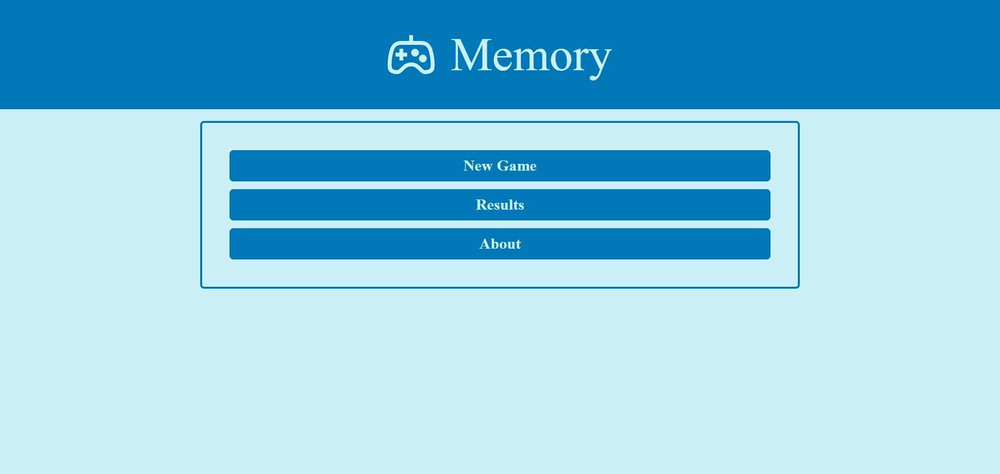
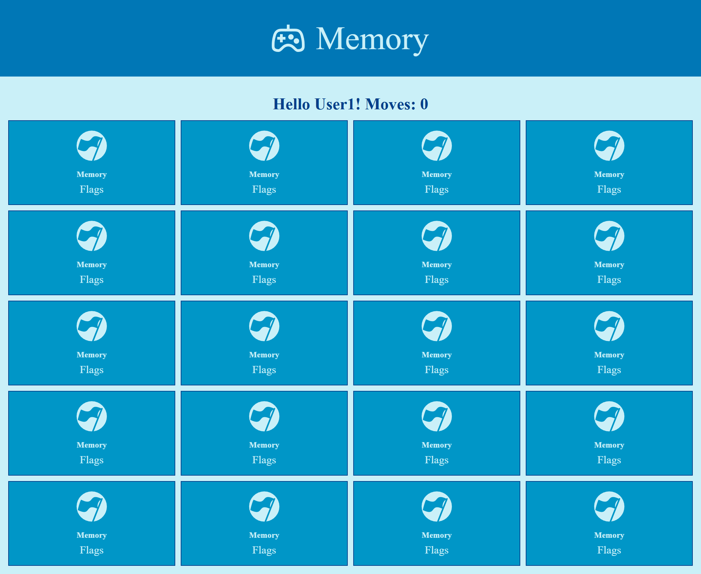
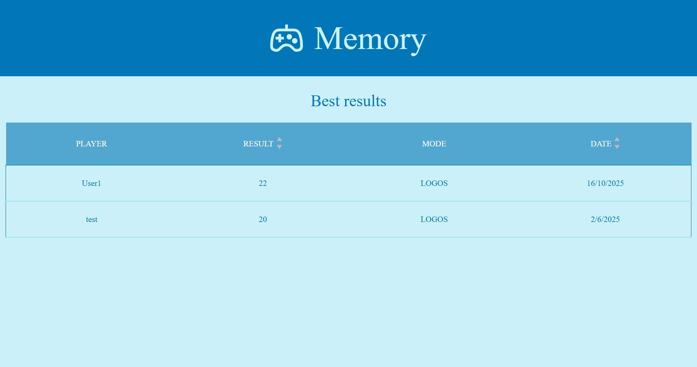

<p align="center">
  
</p>

<h1 align="center">🎮 React Memory Game</h1>

<p align="center">
  <em>A classic memory card game rebuilt with modern React and animations.</em>
</p>

<p align="center">
  <a href="https://github.com/mateuszlubianka1993/react-memory-game">
    
  </a>
  
  
  
</p>

---

## 🚀 Live Demo
🔗 **[Open App Here](https://x-react-memory-game.netlify.app/)**

---

## 🧠 Game Overview

A simple but complete **Memory Game** built with React and TypeScript.  
The player flips cards to find matching pairs, with smooth animations and scoring logic handled by React’s state management.

---

## 🕹️ Gameplay

- **Menu options:**
  - 🆕 **New Game** – start a new session  
  - 🏆 **Results** – view saved best scores  
  - ℹ️ **About** – short info about the project  

- **New Game setup:**
  - Enter your **player name**  
  - Choose a **game mode** (Flags / Logos)  
  - Optionally enable **Multiplayer mode** (vs computer)

- **During play:**
  - The board (5×4 cards on desktop) displays all tiles face down  
  - Flip two cards to find a match  
  - Correct matches stay revealed, mismatches flip back  
  - A move counter keeps track of your progress  
  - Subtle color and animation feedback on success/failure

- **End of game:**
  - A modal appears showing:
    - 🧩 total moves  
    - 🥇 winner (in multiplayer mode)  
    - 🎯 options to **Restart** or **Save Result** (stored in LocalStorage)

---

## 🧰 Tech Stack

| Technology | Description |
|-------------|-------------|
| **React 18 + TypeScript** | Core UI and logic |
| **Vite** | Development and build tool |
| **React Router** | Page navigation |
| **Framer Motion** | Animations and transitions |
| **SASS (SCSS)** | Styling and design system |
| **LocalStorage API** | Persistent user results |
| **Jest + Testing Library** | Unit and component testing |

---

## ✨ Features

- 🎮 Single-player & multiplayer mode (vs computer)  
- 🧩 Two visual themes: flags & logos  
- 🧠 Smart game logic and move counter  
- 💾 Results stored in LocalStorage  
- 🎨 Smooth animations and transitions  
- 🪄 Simple responsive layout  
- 🧪 Unit tests with Jest & RTL  

---

## 🗂️ Project Structure
```bash
src/
├── assets/
│ └── images/
├── components/
│ ├── Card/
│ ├── Modal/
│ ├── Menu/
│ ├── Board/
│ └── UI/
├── pages/
│ ├── Home.tsx
│ ├── Game.tsx
│ ├── Results.tsx
│ └── About.tsx
├── hooks/
├── utils/
├── App.tsx
└── main.tsx
```

---

## 🖼️ Screenshots

<p align="center">
  <strong>🏠 Main Menu</strong><br />
  
</p>

<p align="center">
  <strong>🎮 Game Board</strong><br />
  
</p>

<p align="center">
  <strong>🏆 Results Screen</strong><br />
  
</p>

---

## ⚙️ Installation & Setup

```bash
# Clone repository
git clone https://github.com/mateuszlubianka1993/react-memory-game.git

cd react-memory-game

# Install dependencies
npm install

# Start development server
npm run dev

# Build production version
npm run build

# Run tests
npm test
```
--- 

## 🧩 Logic Overview
Game state is fully managed with React hooks

The card grid and flipping animations use Framer Motion

User progress and results are persisted via LocalStorage

All routes handled with React Router (SPA)

## 🧭 Next Steps
⏱️ Add difficulty levels (easy / medium / hard)

🌙 Dark mode support

🌍 Online multiplayer via WebSocket

📊 Enhanced statistics screen

🔊 Sound effects

## 👨‍💻 Author
Mateusz Lubianka
Frontend Developer & JavaScript
